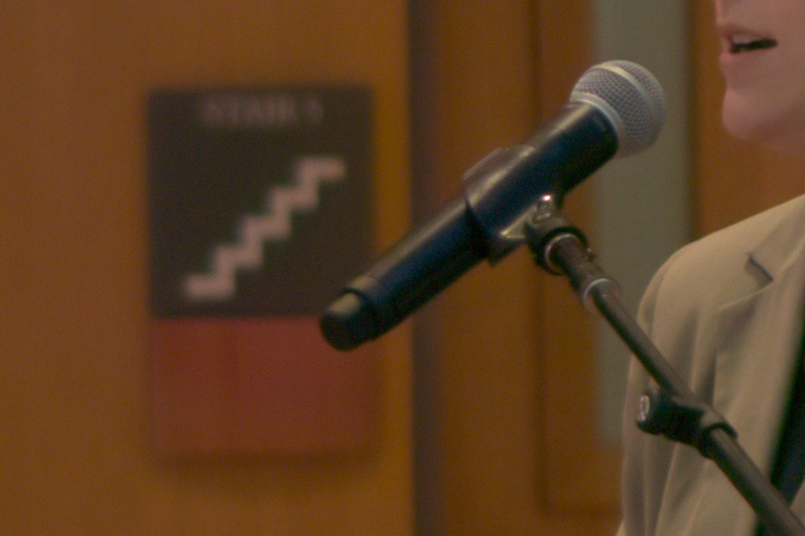
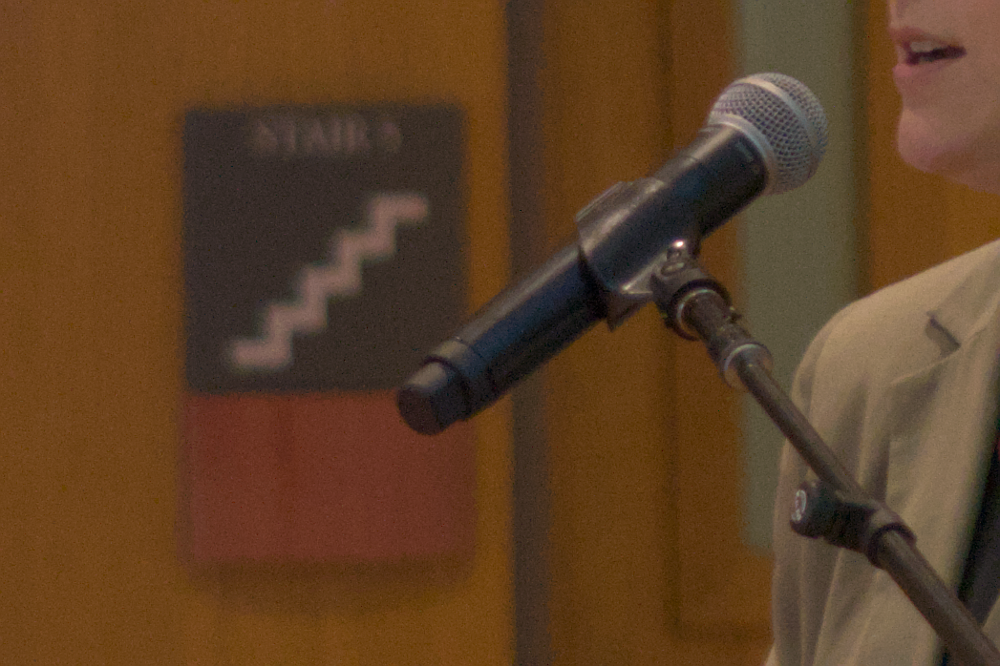

# OpenDenoise

AI denoising for RAW photography that outputs DNG files you can edit non-destructively in darktable.

## What this is

This is a hobby project by an amateur photographer who wanted to see if we could take an existing AI denoise model (trained on normal sRGB photos) and apply it to raw sensor data -- keeping the entire editing workflow inside darktable instead of bouncing files through Lightroom just for AI denoising.

It works better than expected, but there's almost certainly low-hanging fruit we haven't found yet. The settings we landed on came from eyeballing 9 rounds of A/B experiments on a handful of Sony ARW test images -- not from rigorous measurement with proper metrics. More testing and measuring would be worthwhile, and we'd welcome help from anyone who knows more about image processing, noise modeling, or RAW photography than we do.

No open-source tool currently does what Lightroom's "AI Denoise" does. This is a rough first pass at filling that gap.

## Quick start

Requires Python 3.11+ and PyTorch. PyTorch must be installed separately because the install command depends on your GPU (NVIDIA/AMD/CPU) -- see [pytorch.org](https://pytorch.org/get-started/locally/).

```bash
git clone https://github.com/chbornman/OpenDenoise
cd OpenDenoise
pip install .

# Download model weights (~70 MB)
opendenoise --download-models

# Denoise a RAW file -> DNG
opendenoise photo.ARW --mode bayer
```

The output DNG opens in darktable with full RAW editing capability -- white balance, exposure, tone curves, everything.

## Status

**Working prototype.** The core bayer pipeline produces usable results on Sony ARW files. See [What's untested](#whats-untested) for known gaps and [TODO.md](TODO.md) for the full roadmap.

## The hack

We take [SCUNet](https://github.com/cszn/SCUNet) (a denoise model trained on regular sRGB photos with synthetic noise) and shove raw linear sensor data through it. Then we write the result back as a DNG file that darktable opens as a RAW.

**This shouldn't work well.** The model has never seen linear Bayer data. RAW sensor data is linear (darks are much darker, highlights much brighter), has signal-dependent Poisson-Gaussian noise (not the synthetic Gaussian/JPEG noise the model expects), and we're feeding it at half resolution through a fake RGB conversion.

**But it works.** At the default settings (L60/C60, rg1b_rg2b channel strategy), you get visibly cleaner images with good detail preservation. The output is a real DNG that darktable treats as a RAW file.

The model is a swappable black box. The actual contribution is the **pipeline**: extracting Bayer data, packing it for a 3-channel model, and writing valid DNG files that darktable/rawspeed actually accepts. That last part -- getting the DNG structure right -- was honestly harder than the denoising. When better models come along (especially ones trained on real RAW data), they drop right in.

## Comparison

Crop from a Sony A7CR ARW (61MP, ISO 3200), all exported from darktable with the same base edit settings.

### Original (noisy RAW)


Visible noise throughout, especially in the background wall and shadows.

### OpenDenoise output (DNG, default L60/C60 settings)



Denoised DNG opened in darktable with no additional editing. Noise is reduced while the microphone mesh and fabric texture are preserved. Note: there are slight color shifts -- greens in the shadows and reds shifting slightly toward magenta. These are [known issues](TODO.md#known-color-issues).

### darktable's built-in denoise (profiled, strength 1.0)



darktable's own denoise (profiled) module at full strength on the original ARW. Operates post-demosaic, so it's working on different data than OpenDenoise.

### OpenDenoise + darktable editing


The OpenDenoise DNG edited to preference in darktable (exposure, color, sharpening). Because the output is a real DNG, you have full non-destructive RAW editing -- this is the whole point.

## Usage

```bash
# Bayer mode (recommended) -- outputs DNG
opendenoise ~/Photos/*.ARW --mode bayer

# Adjust overall denoise strength (0.0 = off, 1.0 = full)
opendenoise photo.ARW -m bayer -s 0.75

# Separate luma/chroma control (kill color noise, preserve detail)
opendenoise photo.ARW -m bayer --luma-strength 0.4 --chroma-strength 0.8

# Output to specific directory
opendenoise photo.ARW -m bayer -o ~/denoised/

# Post-edit mode -- denoise already-exported TIFFs
opendenoise ~/exports/*.tif -m post

# Full demosaic mode -- outputs linear TIFF (slower, larger)
opendenoise photo.ARW -m raw
```

### CLI options

```
opendenoise INPUT [INPUT...] [options]

  -m, --mode              bayer|raw|post (default: auto-detect)
  -s, --strength          0.0-1.0 (default: 0.6)
  --luma-strength         Luminance denoise strength (default: same as --strength)
  --chroma-strength       Chroma denoise strength (default: same as --strength)
  -o, --output            Output directory
  --model                 Path to .pth model file
  --tile                  Tile size (default: auto)
  --fp16                  Half precision inference
  --cpu                   Force CPU (slow)
  --gamma                 Apply gamma curve before denoising (bayer mode)
  --compression           TIFF compression for raw mode: zstd|deflate|lzw|none
  --suffix                Filename suffix (default: _denoised)
  --no-suffix             No filename suffix
  --download-models       Download default model weights and exit
```

## Installation

### 1. Install PyTorch

PyTorch is not listed as a pip dependency because the install command varies by GPU. Pick yours from [pytorch.org](https://pytorch.org/get-started/locally/):

```bash
# NVIDIA GPU (CUDA)
pip install torch torchvision --index-url https://download.pytorch.org/whl/cu124

# AMD GPU (ROCm)
pip install torch torchvision --index-url https://download.pytorch.org/whl/rocm6.2

# CPU only (slow, but works)
pip install torch torchvision --index-url https://download.pytorch.org/whl/cpu
```

### 2. Install OpenDenoise

```bash
git clone https://github.com/chbornman/OpenDenoise
cd OpenDenoise
pip install .
```

### 3. Download model weights

```bash
opendenoise --download-models
```

This downloads the SCUNet PSNR and GAN models (~70 MB each) to the `models/` directory.

### 4. Denoise

```bash
opendenoise photo.ARW --mode bayer
```

Output goes to a `_denoised/` directory next to the input by default.

## What's been built

### Core pipeline

- **Bayer denoise mode** (the main thing): ARW -> extract Bayer -> pack 2x2 -> denoise -> unpack -> DNG. Outputs valid DNG files that darktable opens with full RAW editing.
- **Raw mode**: RAW -> demosaic -> denoise linear RGB -> compressed TIFF.
- **Post mode**: TIFF/PNG -> denoise -> TIFF/PNG. For already-exported images.

### Current default settings

These came from 9 rounds of A/B experiments on a few Sony ARW test images. They're reasonable starting points, not gospel:

- **L60/C60**: Luma strength 0.6, chroma strength 0.6.
- **rg1b_rg2b channel strategy**: Two-pass denoising -- [R,G1,B] and [R,G2,B] -- averaging overlapping R and B results. Preserves the G1/G2 distinction. ~2x slower than single-pass but noticeably cleaner.
- **SCUNet PSNR model**: Smoother, more conservative than the GAN variant (which has a green cast on linear data).

### Other things that are in place

- **Luma/chroma split**: Separate strength for luminance (detail) and chrominance (color noise) via YCbCr decomposition.
- **Tile blending**: Cosine-feathered overlap (64px) eliminates visible tile seam artifacts.
- **Experiment system**: Grid-based A/B testing for all pipeline knobs. Useful for tuning.
- **Complementary with darktable**: This denoiser and darktable's built-in denoiser operate at different pipeline stages (Bayer vs post-demosaic) and stack well.

## What's untested

These are things that are built but haven't been verified, or areas where we just haven't done the work yet:

- **CLI bayer mode end-to-end**: Recently refactored to route through the experiment system. Output path handling was fixed but the full CLI flow hasn't been run since the refactor.
- **Other camera brands**: Only tested on Sony ARW. Should work with any rawpy-supported format (Canon CR2/CR3, Nikon NEF, etc.) but hasn't been tried.
- **Other test images**: The L60/C60 defaults were tuned on one image (CBR08387.ARW). They might not be optimal for different noise levels, ISOs, or subjects.
- **Raw mode and post mode**: Haven't been touched during the experiment phase. Probably still work but not re-verified.
- **FP16 inference**: The `--fp16` flag exists but hasn't been tested much.
- **Darktable Lua plugin** (`darktable/opendenoise.lua`): Exists but untested since DNG writing was fixed. Also hardcodes AMD GPU settings that won't work for NVIDIA users.

## How it works (technical)

### The Bayer denoise pipeline

A digital camera sensor captures light through a Color Filter Array (CFA) -- a mosaic pattern where each pixel only records one color (red, green, or blue). RAW editors "demosaic" this into a full-color image.

We denoise *before* demosaicing:

1. **Extract** raw Bayer sensor data and metadata (CFA pattern, black/white levels, color matrix, white balance, orientation) using rawpy/libraw.

2. **Pack** 2x2 Bayer blocks into a half-resolution 4-channel image. A 9566x6374 sensor becomes 4783x3187x4.

3. **Denoise** with two passes (rg1b_rg2b strategy): feed [R,G1,B] and [R,G2,B] through the model separately, then merge -- averaging R and B from both passes, keeping G1 and G2 from their respective passes. This gives the model real color context while preserving the G1/G2 distinction.

4. **Blend** the original and denoised images separately in luma and chroma (YCbCr decomposition), so you can control noise reduction for detail and color independently.

5. **Write DNG** with proper SubIFD structure, CFA tags, color matrices, and metadata that darktable/rawspeed accepts.

### DNG writing (hard-won knowledge)

Getting darktable to actually open the output as a RAW file required figuring out several non-obvious things:

- rawspeed requires SubIFD structure: thumbnail in main IFD (`NewSubfileType=1`), CFA data in SubIFD (`NewSubfileType=0`).
- No deflate compression for integer data (rawspeed only supports it for float).
- ColorMatrix1 must be SRATIONAL (type 10), AsShotNeutral must be RATIONAL (type 5). Wrong types = garbled colors.
- AsShotNeutral is the *inverse* of white balance multipliers, not the multipliers themselves.
- `rawpy.postprocess()` mutates internal state and corrupts `raw_pattern`. Must extract all metadata first.

### The model

[SCUNet](https://github.com/cszn/SCUNet) (2022) -- a Swin Transformer + UNet hybrid trained on synthetic noise. Loaded via [spandrel](https://github.com/chaiNNer-org/spandrel). We use the PSNR variant by default.

The model was trained on sRGB images with synthetic noise, not real camera sensor noise. It works surprisingly well on linear Bayer data despite the domain mismatch, but there's room for improvement. See [TODO.md](TODO.md).

## Processing modes

| Mode | Pipeline | Output | Approx. speed | Approx. size |
|------|----------|--------|---------------|-------------|
| `bayer` | RAW -> Bayer denoise -> DNG | Editable RAW | ~36s (2-pass) | ~120 MB |
| `raw` | RAW -> demosaic -> denoise -> TIFF | Linear TIFF | ~70s | ~250 MB |
| `post` | TIFF/PNG -> denoise -> out | Same format | ~25s | varies |

Speed estimates for a 61MP Sony image on AMD Radeon Pro V620 (ROCm). NVIDIA GPUs with more CUDA cores may be faster. CPU mode works but is very slow.

## Project structure

```
opendenoise/
  __init__.py       Package init
  __main__.py       python -m opendenoise entry point
  cli.py            CLI: argument parsing, dispatch, model download
  engine.py         Model loading, tiled inference with cosine-feathered blending
  experiment.py     Experiment system: grid runner, channel strategies, luma/chroma split
  mode_bayer.py     Bayer extract/pack/unpack/DNG writing
  mode_raw.py       Full demosaic -> denoise -> TIFF
  mode_post.py      Post-export denoise
models/             Model weights (not in git, use --download-models)
darktable/
  opendenoise.lua   Darktable Lua plugin (untested)
docs/               Comparison screenshots
```

## See also

- [TODO.md](TODO.md) -- Future improvements and open-source roadmap
- [EXPERIMENTS.md](EXPERIMENTS.md) -- Experiment plan and results from tuning the pipeline

## License

MIT
